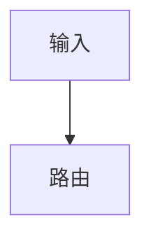

Doc pages are plain Markdown; the theme supplies all styling.

````md
---
title: 页面标题
description: 一句话说明页面用途。
---

# 页面标题

开头一段：用途与边界。

## 契约 / 数据流 / 配置 / 验证

| 项 | 说明 |
| --- | --- |

::: tip
VitePress 原生提示块即可，无需自定义 HTML。
:::


````

Add the route to the sidebar (`config/website/vitepress.config.mts`), `website/tests/site.spec.ts`, and `development/index.md` (see `document-feature-updates`).
