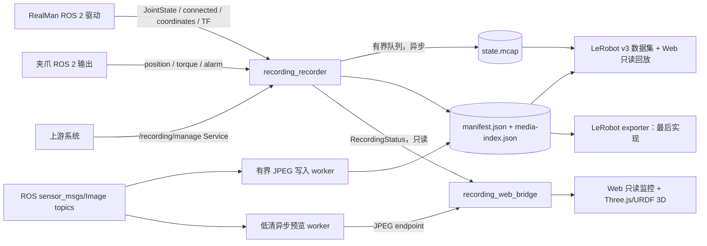

# RealMan Recording 平台：架构、计划与协作说明

> 这是 `src/recording/` 的接续开发文档。后续 AI 开始修改代码前，必须先阅读本文，并以“当前实现状态”和“目标实现状态”为准，不要把规划内容误认为已经完成的功能。

## 1. 当前目标和边界

平台的核心目标是：作为**按需启动的测试/数据采集组件**，从 RealMan ROS 2 驱动和现有相机推流中只读采集数据，可靠地保存本地原始数据，并提供录制期间的独立监控、LeRobot 转换和 Web 只读回放能力。Rerun 离线回放暂不属于当前验收范围。

### 必须保持的边界

- `recording_recorder` 只订阅驱动输出，不创建 `Robotic_Arm`、不直接调用 RealMan SDK、不发布机械臂运动命令。
- 采集路径不能依赖浏览器、Rerun、Three.js、视频解码或 LeRobot；这些组件异常时不能阻塞 MCAP 写入。
- Web 页面只读展示，不提供开始/暂停/停止录制按钮，也不代理机械臂运动控制。
- 默认 `rm65 up` 的实时展示仍由 `realman_web_control` 提供；只有需要录制测试时才单独启动 `realman_recording`，不得为展示目的要求启动 recording。
- 上游通过 ROS 2 Service 控制录制生命周期；Service 是唯一的录制控制入口。
- LeRobot Web 回放和离线 Rerun 都不属于采集链路；回放异常不能阻塞 MCAP 写入，Rerun 离线工具暂缓。
- LeRobot canonical 转换和 π0.5 adapter 已实现；必须在 Humble/真实 SDK 环境验证前保持失败可见，不能伪造端到端成功。

## 2. 目录结构

```text
src/recording/
├── README.md                              # 本文：交接、计划、TODO、测试
├── realman_recording/                     # ROS 2 Python 包：采集节点和只读 Web 展示
│   ├── realman_recording/                 # 模块名 == 包名（对齐 repo 其它包）
│   │   ├── recorder_node.py               # 订阅、状态机、Service、MCAP 生命周期
│   │   ├── web_bridge_node.py             # 只读 ROS 状态聚合、WebSocket
│   │   ├── web_server.py                  # aiohttp 静态页/WS/预览 + /api/layout + /models
│   │   ├── layout_manifest.py             # 三臂展示 manifest（读 three_robots.yaml）
│   │   ├── topic_catalog.py               # 录制 topic→消息类型/类型名 的单一事实来源
│   │   ├── camera_workers.py              # 原始相机 JPEG 帧归档与低清预览 worker
│   │   ├── state_archive.py               # 有界队列 + rosbag2 MCAP 写入
│   │   ├── session_store.py               # session 目录、manifest 原子更新
│   │   ├── json_io.py                     # 原子 JSON 写（manifest/media-index 共用）
│   │   ├── preflight.py                   # 设备/话题/磁盘/MCAP 预检策略
│   │   ├── lerobot_align.py               # 后置：时间序列对齐数学
│   │   ├── lerobot_schema.py              # canonical v1 特征、单位/坐标系与 topic 顺序契约
│   │   ├── canonical_features.py          # 对齐 raw 数据的速度、FK 与质量字段派生
│   │   ├── kinematics.py                  # 轻量 URDF FK / 四元数速度计算
│   │   ├── joint_state.py                 # JointState 名称/顺序/有限值校验
│   │   ├── lerobot_dataset_store.py       # LeRobot v3 单数据集追加锁
│   │   ├── lerobot_exporter.py            # ADOPT 后异步写入 LeRobot v3 episode
│   │   ├── adapters/pi05.py               # canonical → 显式 π0.5 state/action view
│   │   ├── lerobot_web_replay.py          # Web 只读 LeRobot v3 帧/图像读取
│   │   ├── replay.py                      # 后续 Rerun 回放实验骨架（当前不验收）
│   │   ├── rerun_adapter.py               # 可选实时 Rerun 适配器（非采集依赖）
│   │   └── static/                        # Vite 构建产物（index.html + assets/，随包安装）
│   ├── web/                               # 前端源（index.html + src/main.ts，Vite 构建）
│   ├── launch/recording.launch.py
│   └── test/                              # 无设备可运行的纯逻辑/worker测试
└── realman_recording_msgs/                # ROS 2 interface 包（复数命名）
    ├── srv/ManageRecording.srv            # 上游唯一控制接口
    └── msg/RecordingStatus.msg            # 状态广播
```

目录命名规则：包名使用复数 `realman_recording_msgs`；Python 模块名与包名一致（`realman_recording/realman_recording/`）。LeRobot Web 回放由 `lerobot_web_replay.py` 提供；Rerun adapter 和离线 `replay.py` 仅作为后续实验代码保留。不要再创建 `recording/recording/...` 或重复父子包目录。

## 3. 总体架构



### 数据隔离原则

1. ROS 回调只记录接收侧 `SYSTEM_TIME`、更新新鲜度，并尝试无阻塞地把消息放进 MCAP 队列。
2. MCAP 序列化和磁盘写入只由 archive worker 执行；队列满时丢样本并累计计数。
3. 原始相机从 ROS `sensor_msgs/Image` topic 进入独立有界 raw-image archive；JPEG 编码和文件 I/O 在 archive worker 中执行，相机失败不能让机械臂状态采集失败。录制平台不再支持 RTSP/ffmpeg 输入。
4. Web 状态只发送限频 JSON；JPEG 通过独立 endpoint 获取，不进入 MCAP 队列。
5. LeRobot Web 回放只读取已完成的 LeRobot 数据集，不读取 recorder 内存对象，也不连接实时 ROS 图；Rerun 离线回放当前不纳入验收。

`preflight_required_topics` 是每个录制任务的非相机准入集合。默认配置列出三臂 joint state 和三夹爪 position；torque、alarm、teleop action 虽可被录制，但不会因某个任务未使用它们而阻止 START。要求这些观测的 profile 可把对应 topic 显式加入此配置。

笛卡尔 action 话题同样只读归档。`cartesian_command_frames` 必须与上游
`TwistStamped.header.frame_id` 一一对应；当前 RealMan 控制路由使用各臂的
`l/m/r/work/cell` 工作坐标系，而不是 URDF 的 `base_link`。导出器遇到坐标系不一致时会拒绝该帧，避免把不同坐标系的速度混入同一 action。

## 4. 当前配置事实

权威运行配置位于仓库根目录 `config/ros/recording.yaml`。

- 机械臂：3 个，命名空间为 `l`、`m`、`r`。
- 录制相机：4 路，`realsense`、`orbbec-left`、`orbbec-middle`、`orbbec-right`。
- `config/ros/cameras_ros2.yaml` 当前实际定义 3 个 Orbbec 设备：`left`、`middle`、`right`。
- `realsense` 是额外相机源，不属于当前三路 Orbbec ROS2 USB 配置。
- Web 预览必须读取录制配置中的 `camera_ids` 与 `camera_image_topics`，不能把相机数量硬编码成 3。
- 相机 ID 和 URL 必须一一对应且 ID 唯一；不满足时启动/预检失败。

当前主要驱动输入：

```text
/<l|m|r>/joint_states                 sensor_msgs/msg/JointState
/<l|m|r>/connected                    std_msgs/msg/Bool
/<l|m|r>/coordinates/state             std_msgs/msg/String
/tf                                   tf2_msgs/msg/TFMessage
arm_action_topics                     geometry_msgs/msg/TwistStamped（只读）
gripper_position_topics               std_msgs/msg/Float64
gripper_torque_topics                 std_msgs/msg/Bool
gripper_alarm_topics                  std_msgs/msg/Int32
```

## 5. ROS 2 Service 合同

Service：`/recording/manage`，类型：`realman_recording_msgs/srv/ManageRecording`。

| 命令 | 作用 | 是否创建 session |
|---|---|---:|
| `PREPARE=4` | 只执行诊断：默认检查 4 路相机、3 臂 joint state、3 夹爪 position 的话题新鲜度、机械臂连接、磁盘空间、MCAP backend；state-only 调用可显式 `record_cameras=false`。新鲜数据的较大 receipt-walltime 差只标记需要离线对齐 | 否 |
| `START=0` | 每次都在服务端重新执行与请求相符的健康预检；成功后才创建 session、打开 MCAP 和相机 JPEG archive，并将对齐触发结论写入 manifest。`PREPARE` 是给上游诊断的可选调用，不是强制前置步骤 | 是（预约触发时） |
| `STOP=1` | 停止 MCAP/JPEG archive worker，写最终 manifest | 否 |
| `ADOPT=2` | 标记 READY session 采用，并异步提交后置 LeRobot 转换 | 否 |
| `DISCARD=3` | 标记 READY session 舍弃，但保留原始文件审计 | 否 |

时间戳约定：所有接收时间、session 创建/结束时间和 ADOPT/导出审计时间均使用 ROS 2 `SYSTEM_TIME`（epoch nanoseconds）；MCAP bag record time 使用回调接收时间；消息自身的 `header.stamp` 若存在必须原样保留。仅录制时长的本地计时使用单调时钟；浏览器倒计时只显示 `/recording/status`，不能决定停止时刻；预约开始在触发时重新执行预检。

`/recording/manage` 是唯一的会话控制入口；录制平台不再提供 `recording/manage_session` Action。Web 保持纯只读，不创建任何控制客户端。

## 6. Session 文件格式

```text
<recording_root>/<session_id>/
├── state.mcap
├── videos/
│   ├── <camera_id>/<receipt_walltime_ns>.jpg
│   └── media-index.json                   # 每帧 path/receipt + 每路 accepted/dropped/errors
├── metadata/robot.urdf         # 启动时快照的 FK 真值来源
├── metadata/camera_calibration.yaml # 可选：配置的已解算标定结果快照
├── manifest.partial.json       # 录制期间原子更新（含 URDF hash/feature capability）
├── manifest.json               # STOP 后原子 rename，表示 finalized
└── export/lerobot/             # ADOPT 后异步转换目标，当前仍后置
```

manifest 至少包含 `schema_version`、`session_id`、`metadata.profile/task`、起止时间锚点、文件位置、最终 summary、`decision` 和 `export` 状态。`accepted_samples` 表示成功写给 writer 的样本；`enqueued_samples`/`dropped_samples` 用于区分队列背压和实际落盘失败。JPEG 队列 drop 只记录质量统计；但 `camera_write_errors>0` 表示已接收帧未能可靠落盘，session 必须进入 `FAILED`，不能 ADOPT。

LeRobot 导出 receipt 会原样引用 `media-index.json` 的每路相机
`accepted/dropped/errors` 统计；旧 session 没有该统计时 receipt 标记为
`UNAVAILABLE`，不会编造质量数据。

`manifest*.json`、`videos/media-index.json` 与 `export/lerobot-v3.json` 均通过同一
原子 JSON 写入器落盘：进程中断时应保留旧的完整文件或新的完整文件，不能留下可被
回放器误读的截断 receipt。

`calibration_snapshot_path` 为空时，session 的 canonical metadata 明确写入 `calibration.state=UNAVAILABLE`；这类数据可以用于纯 2D 行为克隆，但不能冒充具备可靠几何标定的数据。配置该路径后，recorder 在 START 前复制该文件到 `metadata/camera_calibration.yaml` 并保存 SHA-256 和 version；配置了不存在的路径会拒绝启动。

## 7. Web 与 3D 展示方案

Web 只做实时只读展示，不放录制控制按钮。页面组件建议保持以下分区：

1. 顶部连接和采集健康摘要。
2. 相机组件：按配置动态生成 4 个卡片；低清 JPEG 通过独立 URL 获取。
3. 机械臂组件：动态生成 3 个 arm 卡片，显示连接、6 个关节和坐标摘要。
4. 3D 组件：复用 `src/driver/realman_web_control/web/src/main.ts` 的 Three.js + `urdf-loader` 思路，加载三臂 URDF 和 `three_robots.yaml` 的位姿，将 `/l|m|r/joint_states` 映射到模型。
5. 录制状态组件：显示 PREPARE/RECORDING/FINALIZING/READY/FAILED、elapsed、remaining、drop count。

不要直接复用完整 Web Control bundle，因为它包含运动控制、Action、MOVEJ/MOVEL 等不属于录制页面的功能。应抽取只读 3D viewer 或建立独立前端构建入口。

## 8. LeRobot Web 回放与 Rerun 边界

Web 仪表盘的“回放”页读取已 ADOPT 且 LeRobot 导出成功的 episode，提供 LeRobot Studio
风格的深色工作台：左侧 episode 侧栏、中央同步相机拼图和播放时间轴、右侧 Canonical 字段检视器，下面排列回放 3D、关节和夹爪组件。深色中性底色配蓝色交互强调，仅用于当前选择、焦点和时间轴；录制页的组件位置保持不变。向量字段可逐分量选择曲线；关节、EE pose/velocity 和 Cartesian command 根据 receipt 中的 joint/frame metadata 显示语义标签。回放支持播放速度/逐帧、关节/夹爪/3D viewer、Canonical 字段选择和
SVG 曲线，以及按需 JPEG 图像接口：`/api/lerobot`、
`/api/lerobot/<session>/frames`、`/api/lerobot/<session>/frames/<index>/cameras/<id>`。
它只读取 LeRobot v3，不回退到 MCAP/JPEG 原始文件，也不连接实时 ROS 图。帧 API 会根据当前数据集 schema 动态返回全部非图像标量/向量字段，包括可选 `action.command.gripper` 和后续新增的数值/布尔字段；图像仍通过独立按需 JPEG endpoint 获取。回放摘要公开 receipt 中的 `quality_sync_source_ids`，字段检视器据此为 `quality.sync_error_ns` 向量标注相机/topic 名；帧 API 另返回 `source_timestamps_ns`，即策略帧 walltime 加对应 signed skew。该绝对纳秒时间以十进制字符串传输，避免 JavaScript number 丢失 Unix epoch 纳秒精度。若 source ID 数量与同步误差向量宽度不一致，回放明确报错而不猜测映射。
回放图像由独立请求按需解码，并缩放到最长边 640×360、JPEG quality 65，降低高分辨率视频的网络与浏览器负载；原始 LeRobot 视频保持不变。工控机真实 episode 已通过 Web API 验证：118 帧、17 个字段、四路 JPEG 可读，D435 预览从约 156 KB 降到约 22 KB。
回放 catalog 的 SDK dataset 句柄使用默认容量为 4 的 LRU 缓存；缓存满时淘汰最近最少使用的空闲句柄。同一 episode 的摘要、帧和视频解码访问由每数据集锁串行化；正在读取的句柄会暂时固定，不能在读取中途被淘汰。并发读取数超过缓存容量时，缓存可能暂时超限，读取结束后会再次收敛到上限。该缓存只影响 Web 回放资源，不影响 recorder 或 MCAP writer。
Rerun 离线回放与视频分析暂不纳入当前验收；`replay.py` 和 Rerun adapter 仅保留骨架。

## 9. 实施计划（按优先级）

### P0：采集可靠性

- [x] 有界 MCAP archive：非阻塞 enqueue、序列化 worker、关闭 writer、写错误统计。
- [x] session manifest 原子更新和 ADOPT/DISCARD 决策。
- [x] 原子 JSON 写入在 rename 失败时保留旧文档并清理临时文件；故障不会留下可误读的半写入 manifest。
- [x] ROS `sensor_msgs/Image` 有界 JPEG 写入 worker（按 receipt walltime 记录每帧；编码不在 ROS 回调执行）。
- [x] 录制前 PREPARE 设备检查。
- [x] 预约开始在触发时后台复检。
- [x] 在 `recording-test` Humble 容器加载 ROS interface，并手工运行 recorder Service
  PREPARE/START/自动结束/重复 STOP 回归（完整自动化故障注入仍待补齐）。
- [x] Service 生命周期命令已串行化；重复 STOP 在自动结束后返回明确失败，不会创建或破坏新会话。
- [x] 自动化覆盖 writer 写入异常、manifest 更新期间子进程崩溃后的恢复、重复 STOP、并发 PREPARE/START，以及隔离 ROS graph 上的真实 Service/MCAP 生命周期。
- [x] Humble 容器中杀死运行中的 recorder 进程，再启动完整 recorder ROS 节点并恢复 orphan session。
- [ ] 补充受限文件系统上的真实 ENOSPC 故障注入；当前只有 writer `OSError` 注入。

覆盖范围说明：`test_state_archive.py` 已注入 writer `OSError` 验证磁盘写入失败计数，
`test_session_store.py` 通过子进程在写出 `manifest.partial.json` 后调用 `os._exit()`，
再由父进程调用启动恢复入口验证 orphan recovery；
本轮把重复 STOP 和并发 PREPARE/START 从源码字符串断言改为对真实
`RecordingRecorderNode` Service handler 的并发行为测试；新增隔离 ROS domain 的节点集成测试，
用合成 JointState/connected publisher 实际执行 PREPARE→START→MCAP 写入→STOP→重复 STOP→DISCARD，
并验证 recorder 节点正常销毁。另有 `test_web_server.py` 使用独立 asyncio loop 和阻塞 WebSocket client，
验证 ROS-side producer 不等待网络发送、快照只保留最新值，慢 client 超时后被清理。该测试发现并修复了
`web_server.py` 缺少 `json` 导入导致所有 snapshot 广播后台失败的问题。新增
`test_recording_process_recovery.py` 运行真实 recorder 子进程，等待 MCAP 样本写入后强制 SIGKILL，
再启动新 recorder 节点并验证 partial manifest 恢复为 FAILED。Humble recording-test 镜像全套测试现为 107 项通过。
尚未覆盖的是实际受限文件系统 ENOSPC；现有 `OSError("disk full")` 仅验证 writer 错误处理语义。

已在 `recording-test` 做过手工 Service 回归：`PREPARE(record_cameras=false)` 返回
`success=true/state=ARMED`；短时录制自动结束后重复 STOP 返回
`success=false/message=\"no active recording session to stop\"`。这证明接口失败是可见且无副作用的，
但不替代尚未完成的真实磁盘耗尽和运行中 recorder 崩溃/完整节点恢复故障注入。

2026-09-23 又在工控机 `rm65-recording:test` 临时容器中用当前源码完成 colcon build，
启动 `recording_recorder` 与只读 Web bridge；`/healthz` 返回 `read_only_robot=true`，
`/api/lerobot` 在空数据目录下返回空 session 列表。真实 ROS 图上的 PREPARE 返回
`success=false/state=IDLE`，并明确列出 stale joint/gripper topics 与 disconnected arms，
没有创建 session 或启动录制。这只验证运行时边界，不替代传感器恢复后的成功 PREPARE/真实 episode 验收。

随后在 ROS Domain 65 下补齐临时容器的 MCAP plugin 后，`record_cameras=false` 的 3 秒
真实录制已成功完成：manifest 为 `READY`，state MCAP 为 `storage_id=mcap`、3.04 秒、
819 条消息，`accepted_samples=819`、`dropped_samples=0`、`write_errors=0`；`ros2 bag info`
确认三臂 JointState、连接状态、夹爪状态和 Cartesian command topics 已写入。启用四路相机时，
PREPARE 明确拒绝 `camera_middle` stale/`orbbec-middle` unavailable，未创建半完整相机录制。

本轮更新了工控机 `rm65-recording:test` 镜像：基于已安装 MCAP/LeRobot/CPU PyTorch/PyArrow 的测试镜像，
复制当前 recording 源码后重建 ROS 包；验证 `ros2 bag list storage` 包含 `mcap`、
`setuptools=79.0.1` 兼容 Humble `colcon-core<80`，recording 测试 `107 passed`。上一版镜像保留在
`rm65-recording:backup-before-process-recovery-20260923`；更新前版本另保留在
`rm65-recording:backup-before-websocket-race-20260923`；修复 WebSocket 广播前的版本保留在
`rm65-recording:backup-before-websocket-fix-20260923`；更早的订阅销毁修复前版本保留在
`rm65-recording:backup-before-node-teardown-20260923`。完整依赖镜像仍由
`config/docker/recording-test.Dockerfile` 从 Humble base 构建，快速源码刷新定义在
`config/docker/recording-test-refresh.Dockerfile`。另用 LeRobot 0.4.4 SDK 生成带真实视频编码的
临时 v3 episode，经 HTTP list/summary/frames/JPEG API 读回并验证 `source_timestamps_ns` 精确映射；
该 fixture 不是机械臂真机录制，四相机真实 session 仍需设备恢复后验收。
正式部署前应重建包含 `ros-humble-rosbag2-storage-mcap` 的 recording 镜像；可用
`ros2 bag list storage | grep -x mcap` 作为启动前检查，不能使用只有 `sqlite3` plugin 的旧镜像。

### P1：实时 Web 只读展示

- [x] WebSocket 限频状态快照；慢客户端不会阻塞 ROS-side producer，快照合并为最新值，发送超时的客户端被清理。
- [x] 独立低清 JPEG 预览 endpoint/worker。
- [x] 4 路相机动态卡片。
- [x] 移除 Web 页面所有录制控制按钮和 ActionClient 依赖，仅保留展示。
- [x] 从 Web Control 抽取只读 Three.js/URDF 三臂 viewer（已实现为录制包自有的只读 viewer，参考 web_control 的 Three.js + urdf-loader 方案，实时套用 joint_states）。
- [x] 机械臂 3D 模型加载失败时显示明确降级状态，不影响采集。
- [x] 增加夹爪独立组件和每路相机健康/最后帧时间（真实流联调待验证）。

### P2：LeRobot Web 回放 / Rerun 边界

- [x] Web 只读回放已读取 LeRobot v3 episode，返回 canonical state/action、时间戳和相机 JPEG；SDK 读取与 JPEG 解码在线程池执行，不阻塞实时快照或录制关键路径。
- [x] 回放 API 只接受已 ADOPT 且 export `SUCCEEDED` 的 session，并限制 dataset root 在配置目录内。
- [x] schema 中新增的非图像数值/布尔 feature 自动进入帧 API；dataset 句柄使用有界 LRU，并串行化同 episode 的并发 SDK 读取。
- [x] `quality.sync_error_ns` 用 receipt `quality_sync_source_ids` 标注来源；帧 API 返回精确十进制字符串 `source_timestamps_ns`，不让浏览器浮点数损失 epoch 纳秒。
- [x] Rerun 离线回放和视频分析不纳入当前实现范围；LeRobot v3 的 Web 回放是本平台的验收路径。

### P3：Canonical LeRobot v3 与 π0.5 view

- [x] 固定 `lerobot==0.4.4` writer，ADOPT 后异步追加一个 dataset episode。
- [x] 导出集合根目录按 `repo_id` 使用稳定子目录（例如 `realman__pi05-three-arm`）；传入已含
  `meta/info.json` 的目录时继续追加该已有数据集，避免与历史 session 目录冲突。
- [x] 固定 FPS image anchor、LINEAR/FORWARD_FILL、最大 gap 拒绝和 source/image skew quality 向量。
- [x] materialize 关节位置/差分速度、URDF FK EE pose、四元数 shortest-arc EE velocity、夹爪位置和真实 Cartesian command。
- [x] 启动时 snapshot URDF，并将 hash、坐标系、单位、feature/generator contract 写入 manifest/receipt。
- [x] canonical → π0.5 adapter：checkpoint 的 state/action 维度与姿态编码必须显式配置。
- [x] Humble 容器：用已生成 episode 完成 LeRobot SDK reload（训练读取图像时显式使用
  `video_backend=\"pyav\"`）和 π0.5 adapter smoke（state=24、action=18）。
- [ ] 在实际 OpenPI 训练环境运行 one-batch smoke；OpenPI 未安装时不得伪造通过。

## 10. TODO 规则

代码中的 `# ai TODO` 必须说明 TODO 所属阶段、函数输入输出和失败行为、是否允许影响录制关键路径、以及需要新增或修改的测试。禁止用 TODO 掩盖已经宣称完成的功能；未实现功能必须在文档和返回状态中明确标记。

## 11. 测试矩阵

### 不依赖设备的测试

- `python3 -m compileall -q src/recording`
- 在 `src/recording/realman_recording` 目录运行 `python3 setup.py build_py`。
- preflight：新鲜/过期话题、连接状态、磁盘和 MCAP 可用性。
- state archive：队列满丢弃、停止 no-op、写入成功/失败计数、writer close。
- camera worker：多路隔离、有界队列丢帧、media-index、JPEG 分帧和写入错误统计。
- session store：partial/final manifest 原子性、路径遍历拒绝、ADOPT/DISCARD。
- web protocol：运动命令、超长消息、非法时间戳必须拒绝。
- LeRobot canonical 导出与 Web 回放 catalog：schema、对齐、canonical frame、数据集目录和路径安全；Rerun adapter/replay 暂不作为验收项。
- Web 回放浏览器回归（mock episode/image API，桌面与窄屏布局、字段扩展、模式切换）：`cd website && node_modules/.bin/playwright test --config ../config/recording/playwright.config.mjs`。
- Humble 隔离 ROS domain 的真实 recorder Service 集成：合成传感器消息、PREPARE/START/STOP/重复 STOP/DISCARD、MCAP 落盘与节点销毁。
- runtime probe：频率计数与 topic 去重的纯逻辑检查；真实 ROS 图探针需在 Humble/工控机运行。

### 必须在 Humble/设备环境执行的测试

- `colcon build --packages-up-to realman_recording realman_recording_msgs`
- `colcon test --packages-select realman_recording realman_recording_msgs`（`realman_recording` 已在 `setup.py` 声明 `tests_require=["pytest"]`，不能把零测试结果当作通过）
- 真实 ROS graph 下确认 3 个机械臂 topic 能持续到达。
- 真机确认 4 路 ROS image topic 逐路预检、录制、STOP 和 index。
- 用 rosbag2 重新读取 `state.mcap`，确认 topic type、时间戳和样本数量。
- 浏览器断开或慢客户端时确认 archive dropped 不因展示端增加。
- LeRobot Web 回放读取真实 episode 与相机 JPEG；离线 Rerun 回放暂不验收。

真机验收时还要检查部署是否真的使用当前接口：

```bash
ros2 node info /recording_recorder
```

当前版本必须看到 `/recording/manage` Service，且不应再出现
`/recording/manage_session` Action。如果旧 Action 仍存在，说明工控机运行的是旧
install，不是当前源码；需要停止旧节点、重新 `colcon build --packages-up-to
realman_recording realman_recording_msgs` 并重新 source/install 后再验收。

相机不能只看 publisher 是否存在。对每路 Orbbec 同时检查
`/<camera>/device_status` 的 `device_online` 与 `color_frame_rate_cur`，以及
`color/image_raw` 是否能收到实际帧。多路设备若全部协商到同一个 USB2（480M）Hub，
即使节点和 publisher 都存在，也可能有一路实际帧率为 0；此时应先改用独立 USB3
主板端口/确认 `lsusb -t` 为 5000M，再进行录制验收，不能在 recorder 中复制旧帧。

`recording_runtime_probe` 可选订阅 Orbbec 状态 topic，在 JSON 的
`device_status` 段直接输出上述三个字段；D435 不提供该消息类型时不要传入该参数：

```bash
recording_runtime_probe --duration-sec 5 \
  --device-status-topic /camera_left/device_status \
  --device-status-topic /camera_middle/device_status \
  --device-status-topic /camera_right/device_status
```

宿主没有 ROS 2、pytest、OpenCV 或 Rerun SDK 时，不要通过伪造依赖声称这些运行测试通过；只报告静态检查和纯逻辑冒烟结果。

## 12. 常用验证命令

```bash
# 仓库根目录
python3 -m compileall -q src/recording
docker compose config --quiet
git diff --check

# Python 包构建（必须从包目录执行）
cd src/recording/realman_recording
python3 setup.py build_py

# 文档站点
cd website
npm run build
```

`recording-test` 的独立 Humble overlay 定义在
`config/docker/recording-test.Dockerfile`。从仓库根目录构建新测试镜像（保留旧 tag，方便回滚）：

```bash
docker build --network=host \
  -f config/docker/recording-test.Dockerfile \
  -t rm65-recording:verified .
```

`--network=host` 用于 Docker bridge DNS 无法解析 apt/PyPI mirror 的主机环境；网络正常时也可省略。
大依赖下载默认允许 300 秒的单连接读取超时；网络环境需要时可用
`--build-arg PIP_NETWORK_TIMEOUT=<秒>` 覆盖，不需要手工修改 Dockerfile。
构建后确认 `source /opt/ros/humble/setup.bash && ros2 bag list storage | grep -x mcap` 能列出 `mcap`，
且 Python 可导入 `lerobot`、`PIL`、`pyarrow`，再用该镜像执行 recording-test。

工控机上依赖已安装且验证过后，仅更新工作区源码时可使用
`config/docker/recording-test-refresh.Dockerfile`，避免重新下载大型 PyTorch/LeRobot wheels：

```bash
docker build --network=host \
  -f config/docker/recording-test-refresh.Dockerfile \
  -t rm65-recording:verified .
```

这个快速刷新 Dockerfile 默认以 `rm65-recording:test` 为基础，只复制 recording 源码/配置并重建 ROS 包；
它不是独立构建，不能替代上面的完整 Dockerfile。完成后仍须运行整个 recording 测试集，验证通过后再把新镜像标记为 `rm65-recording:test`。

真实运行时再执行：

```bash
docker compose up realman_recording
ros2 service call /recording/manage realman_recording_msgs/srv/ManageRecording "..."
```

所有运行时数据写入 `recording_root`（Compose 默认挂载到 `/data/realman-recordings`），不得写入仓库 `config/` 或源码目录。
