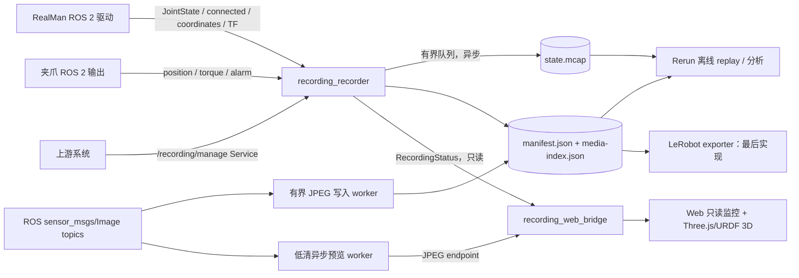

# RealMan Recording 平台：架构、计划与协作说明

> 这是 `src/recording/` 的接续开发文档。后续 AI 开始修改代码前，必须先阅读本文，并以“当前实现状态”和“目标实现状态”为准，不要把规划内容误认为已经完成的功能。

## 1. 当前目标和边界

平台的核心目标是：从 RealMan ROS 2 驱动和现有相机推流中只读采集数据，可靠地保存本地原始数据，并提供实时监控、离线回放和后续 LeRobot 转换能力。

### 必须保持的边界

- `recording_recorder` 只订阅驱动输出，不创建 `Robotic_Arm`、不直接调用 RealMan SDK、不发布机械臂运动命令。
- 采集路径不能依赖浏览器、Rerun、Three.js、视频解码或 LeRobot；这些组件异常时不能阻塞 MCAP 写入。
- Web 页面只读展示，不提供开始/暂停/停止录制按钮，也不代理机械臂运动控制。
- 上游通过 ROS 2 Service 控制录制生命周期；Service 是唯一的录制控制入口。
- Rerun 用于离线回放和离线分析，不作为采集链路的必要依赖。
- LeRobot canonical 转换和 π0.5 adapter 已实现；必须在 Humble/真实 SDK 环境验证前保持失败可见，不能伪造端到端成功。

## 2. 目录结构

```text
src/recording/
├── README.md                              # 本文：交接、计划、TODO、测试
├── realman_recording/                     # ROS 2 Python 包：采集节点和只读 Web 展示
│   ├── realman_recording/                 # 模块名 == 包名（对齐 repo 其它包）
│   │   ├── recorder_node.py               # 订阅、状态机、Service、MCAP 生命周期
│   │   ├── web_bridge_node.py             # 只读 ROS 状态聚合、WebSocket
│   │   ├── web_server.py                  # aiohttp 静态页/WS/预览 + /api/layout + /models
│   │   ├── layout_manifest.py             # 三臂展示 manifest（读 three_robots.yaml）
│   │   ├── topic_catalog.py               # 录制 topic→消息类型/类型名 的单一事实来源
│   │   ├── camera_workers.py              # 原始相机分段与低清预览 worker
│   │   ├── state_archive.py               # 有界队列 + rosbag2 MCAP 写入
│   │   ├── session_store.py               # session 目录、manifest 原子更新
│   │   ├── json_io.py                     # 原子 JSON 写（manifest/media-index 共用）
│   │   ├── preflight.py                   # 设备/话题/磁盘/MCAP 预检策略
│   │   ├── lerobot_align.py               # 后置：时间序列对齐数学
│   │   ├── lerobot_schema.py              # canonical v1 特征、单位/坐标系与 topic 顺序契约
│   │   ├── canonical_features.py          # 对齐 raw 数据的速度、FK 与质量字段派生
│   │   ├── kinematics.py                  # 轻量 URDF FK / 四元数速度计算
│   │   ├── joint_state.py                 # JointState 名称/顺序/有限值校验
│   │   ├── lerobot_dataset_store.py       # LeRobot v3 单数据集追加锁
│   │   ├── lerobot_exporter.py            # ADOPT 后异步写入 LeRobot v3 episode
│   │   ├── adapters/pi05.py               # canonical → 显式 π0.5 state/action view
│   │   ├── replay.py                      # Rerun 离线回放 canonical LeRobot episode
│   │   ├── rerun_adapter.py               # 可选实时 Rerun 适配器（非采集依赖）
│   │   └── static/                        # Vite 构建产物（index.html + assets/，随包安装）
│   ├── web/                               # 前端源（index.html + src/main.ts，Vite 构建）
│   ├── launch/recording.launch.py
│   └── test/                              # 无设备可运行的纯逻辑/worker测试
└── realman_recording_msgs/                # ROS 2 interface 包（复数命名）
    ├── srv/ManageRecording.srv            # 上游唯一控制接口
    └── msg/RecordingStatus.msg            # 状态广播
```

目录命名规则：包名使用复数 `realman_recording_msgs`；Python 模块名与包名一致（`realman_recording/realman_recording/`）。Rerun 的实时 adapter 和离线 `replay.py` 都并入主包，前者仅用于可选调试，后者是正式离线回放入口。不要再创建 `recording/recording/...` 或重复父子包目录。

## 3. 总体架构



### 数据隔离原则

1. ROS 回调只记录接收侧 `SYSTEM_TIME`、更新新鲜度，并尝试无阻塞地把消息放进 MCAP 队列。
2. MCAP 序列化和磁盘写入只由 archive worker 执行；队列满时丢样本并累计计数。
3. 原始相机从 ROS `sensor_msgs/Image` topic 进入独立有界 raw-image archive；JPEG 编码和文件 I/O 在 archive worker 中执行，相机失败不能让机械臂状态采集失败。旧 RTSP/ffmpeg worker 仅保留作迁移兼容，不属于当前 recorder 路径。
4. Web 状态只发送限频 JSON；JPEG 通过独立 endpoint 获取，不进入 MCAP 队列。
5. Rerun 离线程序读取已完成 session，不读取 recorder 内存对象，不连接实时 ROS 图。

`preflight_required_topics` 是每个录制任务的非相机准入集合。默认配置列出三臂 joint state 和三夹爪 position；torque、alarm、teleop action 虽可被录制，但不会因某个任务未使用它们而阻止 START。要求这些观测的 profile 可把对应 topic 显式加入此配置。

## 4. 当前配置事实

权威运行配置位于仓库根目录 `config/ros/recording.yaml`。

- 机械臂：3 个，命名空间为 `l`、`m`、`r`。
- 录制相机：4 路，`realsense`、`orbbec-left`、`orbbec-middle`、`orbbec-right`。
- `config/ros/cameras_ros2.yaml` 当前实际定义 3 个 Orbbec 设备：`left`、`middle`、`right`。
- `realsense` 是额外相机源，不属于当前三路 Orbbec ROS2 USB 配置。
- Web/Rerun 预览必须读取录制配置中的 `camera_ids` 与 `camera_image_topics`，不能把相机数量硬编码成 3。
- 相机 ID 和 URL 必须一一对应且 ID 唯一；不满足时启动/预检失败。

当前主要驱动输入：

```text
/<l|m|r>/joint_states                 sensor_msgs/msg/JointState
/<l|m|r>/connected                    std_msgs/msg/Bool
/<l|m|r>/coordinates/state             std_msgs/msg/String
/tf                                   tf2_msgs/msg/TFMessage
arm_action_topics                     geometry_msgs/msg/TwistStamped（只读）
gripper_position_topics               std_msgs/msg/Float64
gripper_torque_topics                 std_msgs/msg/Bool
gripper_alarm_topics                  std_msgs/msg/Int32
```

## 5. ROS 2 Service 合同

Service：`/recording/manage`，类型：`realman_recording_msgs/srv/ManageRecording`。

| 命令 | 作用 | 是否创建 session |
|---|---|---:|
| `PREPARE=4` | 检查 4 路相机、3 臂 joint state、3 夹爪 position 的话题新鲜度、机械臂连接、磁盘空间、MCAP backend；新鲜数据的较大 receipt-walltime 差只标记需要离线对齐 | 否 |
| `START=0` | 仅使用未过期且通过健康预检的结果创建 session，打开 MCAP 和相机 JPEG archive；将对齐开关与 PREPARE 的触发结论写入 manifest | 是（预约触发时） |
| `STOP=1` | 停止 archive/视频 worker，写最终 manifest | 否 |
| `ADOPT=2` | 标记 READY session 采用，并异步提交后置 LeRobot 转换 | 否 |
| `DISCARD=3` | 标记 READY session 舍弃，但保留原始文件审计 | 否 |

时间戳约定：所有接收时间使用 ROS 2 `SYSTEM_TIME`（epoch nanoseconds）；MCAP bag record time 使用回调接收时间；消息自身的 `header.stamp` 若存在必须原样保留；浏览器倒计时只显示 `/recording/status`，不能决定停止时刻；预约开始在触发时重新执行预检。

`/recording/manage` 是唯一的会话控制入口；录制平台不再提供 `recording/manage_session` Action。Web 保持纯只读，不创建任何控制客户端。

## 6. Session 文件格式

```text
<recording_root>/<session_id>/
├── state.mcap
├── videos/
│   ├── <camera_id>/segment-000000.mkv
│   └── media-index.json
├── metadata/robot.urdf         # 启动时快照的 FK 真值来源
├── metadata/camera_calibration.yaml # 可选：配置的已解算标定结果快照
├── manifest.partial.json       # 录制期间原子更新（含 URDF hash/feature capability）
├── manifest.json               # STOP 后原子 rename，表示 finalized
└── export/lerobot/             # ADOPT 后异步转换目标，当前仍后置
```

manifest 至少包含 `schema_version`、`session_id`、`metadata.profile/task`、起止时间锚点、pause intervals、文件位置、最终 summary、`decision` 和 `export` 状态。`accepted_samples` 表示成功写给 writer 的样本；`enqueued_samples`/`dropped_samples` 用于区分队列背压和实际落盘失败。

`calibration_snapshot_path` 为空时，session 的 canonical metadata 明确写入 `calibration.state=UNAVAILABLE`；这类数据可以用于纯 2D 行为克隆，但不能冒充具备可靠几何标定的数据。配置该路径后，recorder 在 START 前复制该文件到 `metadata/camera_calibration.yaml` 并保存 SHA-256 和 version；配置了不存在的路径会拒绝启动。

## 7. Web 与 3D 展示方案

Web 只做实时只读展示，不放录制控制按钮。页面组件建议保持以下分区：

1. 顶部连接和采集健康摘要。
2. 相机组件：按配置动态生成 4 个卡片；低清 JPEG 通过独立 URL 获取。
3. 机械臂组件：动态生成 3 个 arm 卡片，显示连接、6 个关节和坐标摘要。
4. 3D 组件：复用 `src/driver/realman_web_control/web/src/main.ts` 的 Three.js + `urdf-loader` 思路，加载三臂 URDF 和 `three_robots.yaml` 的位姿，将 `/l|m|r/joint_states` 映射到模型。
5. 录制状态组件：显示 PREPARE/RECORDING/PAUSED/READY/FAILED、elapsed、remaining、drop count。

不要直接复用完整 Web Control bundle，因为它包含运动控制、Action、MOVEJ/MOVEL 等不属于录制页面的功能。应抽取只读 3D viewer 或建立独立前端构建入口。

## 8. Rerun 离线回放/分析计划

Rerun 不参与录制实时关键路径。正式离线回放只接受已 ADOPT 且 LeRobot 导出成功的数据集，入口为
`python3 -m realman_recording.replay`：

```bash
python3 -m realman_recording.replay \
  --session /data/realman-recordings/<session_id>
```

回放器职责：验证 session 的 `decision=ADOPTED`、`export.state=SUCCEEDED` 与 `export/lerobot/` 存在；随后读取固定版本 LeRobot dataset 的 episode/frame、state/action 和视频字段，以其数据集时间轴写入 Rerun。原始 `state.mcap` 与 `videos/` 仅供导出和审计，正式回放绝不回退读取它们。

Rerun 的实时 adapter 可以保留用于调试，但默认关闭；离线 replay 才是正式的数据分析入口。Web 仪表盘没有 dataset/replay API 或回放按钮，只负责实时只读展示。

## 9. 实施计划（按优先级）

### P0：采集可靠性

- [x] 有界 MCAP archive：非阻塞 enqueue、序列化 worker、关闭 writer、写错误统计。
- [x] session manifest 原子更新和 ADOPT/DISCARD 决策。
- [x] ROS `sensor_msgs/Image` 有界 JPEG 写入 worker（按 receipt walltime 记录每帧；编码不在 ROS 回调执行）。
- [x] 录制前 PREPARE 设备检查。
- [x] 预约开始在触发时后台复检。
- [ ] 在 Humble 容器生成 ROS interface 并运行 recorder Service 集成测试。
- [ ] 处理磁盘写满、进程崩溃、重复 STOP、并发 PREPARE/START 的端到端状态机测试。

### P1：实时 Web 只读展示

- [x] WebSocket 限频状态快照。
- [x] 独立低清 JPEG 预览 endpoint/worker。
- [x] 4 路相机动态卡片。
- [x] 移除 Web 页面所有录制控制按钮和 ActionClient 依赖，仅保留展示。
- [x] 从 Web Control 抽取只读 Three.js/URDF 三臂 viewer（已实现为录制包自有的只读 viewer，参考 web_control 的 Three.js + urdf-loader 方案，实时套用 joint_states）。
- [x] 机械臂 3D 模型加载失败时显示明确降级状态，不影响采集。
- [x] 增加夹爪独立组件和每路相机健康/最后帧时间（真实流联调待验证）。

### P2：Rerun 离线回放与分析

- [x] 新增离线回放 CLI 和命令行参数（`realman_recording/replay.py`，`python3 -m realman_recording.replay`）。
- [x] 回放入口拒绝未采用、未成功导出或缺少 LeRobot 数据目录的 session；不再回退原始数据。
- [x] 固定 `lerobot==0.6.1`，按 receipt 的 episode index 读取 canonical frame/视频并写入 Rerun 时间轴。
- [ ] 在 Humble + Rerun SDK 环境解码真实视频 episode（宿主没有该运行时）。

> `replay.py` 的 LeRobot/Rerun 依赖均为惰性导入；纯逻辑（会话生命周期校验、canonical frame 发射、时间轴边界）可在无 ROS 环境单测。它刻意不读取 `state.mcap` 或原始媒体索引；端到端读取真实 LeRobot 视频 episode 仍需在 Humble/设备容器验证（见第 11 节）。

### P3：Canonical LeRobot v3 与 π0.5 view

- [x] 固定 `lerobot==0.6.1` writer，ADOPT 后异步追加一个 dataset episode。
- [x] 固定 FPS image anchor、LINEAR/FORWARD_FILL、最大 gap 拒绝和 source/image skew quality 向量。
- [x] materialize 关节位置/差分速度、URDF FK EE pose、四元数 shortest-arc EE velocity、夹爪位置和真实 Cartesian command。
- [x] 启动时 snapshot URDF，并将 hash、坐标系、单位、feature/generator contract 写入 manifest/receipt。
- [x] canonical → π0.5 adapter：checkpoint 的 state/action 维度与姿态编码必须显式配置。
- [ ] Humble 容器：用真实 episode 运行 SDK reload、Rerun decode 与 OpenPI one-batch smoke（宿主缺少该运行环境）。

## 10. TODO 规则

代码中的 `# ai TODO` 必须说明 TODO 所属阶段、函数输入输出和失败行为、是否允许影响录制关键路径、以及需要新增或修改的测试。禁止用 TODO 掩盖已经宣称完成的功能；未实现功能必须在文档和返回状态中明确标记。

## 11. 测试矩阵

### 不依赖设备的测试

- `python3 -m compileall -q src/recording`
- 在 `src/recording/realman_recording` 目录运行 `python3 setup.py build_py`。
- preflight：新鲜/过期话题、连接状态、磁盘和 MCAP 可用性。
- state archive：队列满丢弃、停止 no-op、写入成功/失败计数、writer close。
- camera worker：多路隔离、pause 分段、media-index、JPEG 分帧、ffmpeg 异常退出。
- session store：partial/final manifest 原子性、路径遍历拒绝、ADOPT/DISCARD。
- web protocol：运动命令、超长消息、非法时间戳必须拒绝。
- Rerun adapter/replay：无 SDK、canonical frame、相机筛选和时间轴边界。
- runtime probe：频率计数与 topic 去重的纯逻辑检查；真实 ROS 图探针需在 Humble/工控机运行。

### 必须在 Humble/设备环境执行的测试

- `colcon build --packages-up-to realman_recording realman_recording_msgs`
- `colcon test --packages-select realman_recording realman_recording_msgs`
- 真实 ROS graph 下确认 3 个机械臂 topic 能持续到达。
- 真机确认 4 路 ROS image topic 逐路预检、录制、暂停/恢复和 index。
- 用 rosbag2 重新读取 `state.mcap`，确认 topic type、时间戳和样本数量。
- 浏览器断开、慢客户端、Rerun 关闭时确认 archive dropped 不因展示端增加。
- 离线 Rerun 回放真实 session，确认图像、关节、夹爪时间轴一致。

真机验收时还要检查部署是否真的使用当前接口：

```bash
ros2 node info /recording_recorder
```

当前版本必须看到 `/recording/manage` Service，且不应再出现
`/recording/manage_session` Action。如果旧 Action 仍存在，说明工控机运行的是旧
install，不是当前源码；需要停止旧节点、重新 `colcon build --packages-up-to
realman_recording realman_recording_msgs` 并重新 source/install 后再验收。

相机不能只看 publisher 是否存在。对每路 Orbbec 同时检查
`/<camera>/device_status` 的 `device_online` 与 `color_frame_rate_cur`，以及
`color/image_raw` 是否能收到实际帧。多路设备若全部协商到同一个 USB2（480M）Hub，
即使节点和 publisher 都存在，也可能有一路实际帧率为 0；此时应先改用独立 USB3
主板端口/确认 `lsusb -t` 为 5000M，再进行录制验收，不能在 recorder 中复制旧帧。

宿主没有 ROS 2、pytest、ffmpeg 或 Rerun SDK 时，不要通过伪造依赖声称这些运行测试通过；只报告静态检查和纯逻辑冒烟结果。

## 12. 常用验证命令

```bash
# 仓库根目录
python3 -m compileall -q src/recording
docker compose config --quiet
git diff --check

# Python 包构建（必须从包目录执行）
cd src/recording/realman_recording
python3 setup.py build_py

# 文档站点
cd website
npm run build
```

真实运行时再执行：

```bash
docker compose up realman_recording
ros2 service call /recording/manage realman_recording_msgs/srv/ManageRecording "..."
```

所有运行时数据写入 `recording_root`（Compose 默认挂载到 `/data/realman-recordings`），不得写入仓库 `config/` 或源码目录。
