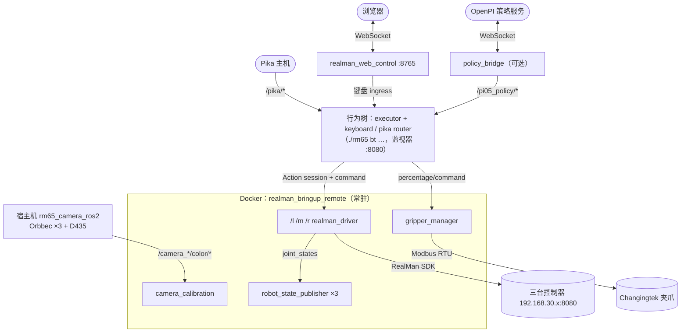
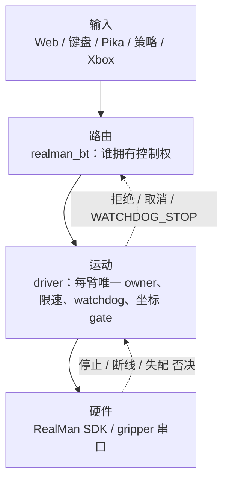
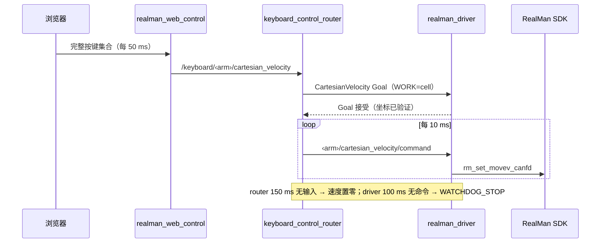

# 系统架构总览

realman_pi 是一套面向**三台 RealMan RM65 机械臂**（左 `l`、中 `m`、右 `r`）的 ROS 2 Humble 控制平台。它把硬件驱动、坐标与安全、多种人机输入（Web、键盘、Pika 手持设备、VLA 策略）、夹爪、相机与标定，以及行为树编排，放进同一个可复现的 Docker 运行环境。机器人描述（URDF、TF、RViz）是它的底座，不是它的主题。

## 运行拓扑

生产入口只有一个：`./rm65 up`（宿主机相机 → Docker 服务），行为树按需另行 `./rm65 bt control`。详见 [CLI 与环境变量](../reference/cli-and-env)。

## 分层与所有权

每一层只做一件事，**越靠下越接近硬件，越靠下越有最终否决权**：

| 层 | 组件 | 拥有什么 | 不拥有什么 |
| --- | --- | --- | --- |
| 输入 | Web 页面、键盘、Pika、策略桥、Xbox | 把人/策略的意图变成 ROS 消息 | 不直接连 SDK；不决定谁有控制权 |
| 路由 | `realman_bt`（`control.xml` + 两个 router） | **当前哪一个输入拥有控制权**（输入模式 `web`/`keyboard`/`policy`/`pika*`/`none`），把输入转成 Action session | 不拥有 SDK 连接，不替代底层运动仲裁 |
| 运动 | `realman_robot_driver` 的 `motion_coordinator`、速度/位姿 session | **每臂唯一的运动 owner**、限速限加速度、watchdog、取消/停止/锁定、坐标 motion gate | 不关心谁在发命令 |
| 硬件 | RealMan SDK 适配器、`gripper_manager` | SDK 句柄/串口、重连、单位换算 | 不做任务逻辑 |
| 基础设施 | `realman_bringup`、Compose、`config/` | 启动编排、配置、日志 | 不拥有 URDF 数值或硬件状态机 |

几条贯穿全局的不变量：

1. **一臂一 owner。** 普通运动、轨迹、速度 session、位姿 session 共享单臂 ownership；`stop` 抢占它。
2. **两层失效保护。** router 在输入停更时先让命令归零；driver 的 `100 ms` watchdog 独立再保护一次，即使 router 崩溃也会停。
3. **坐标是期望状态。** `config/ros/realman_coordinates.yaml` 是权威；驱动连接后回读并自动修复失配，修复失败则关闭该臂的 motion gate（`MOVEL`、`MOVEJ_P` 和速度 session 被拦截，关节空间 `MOVEJ` 仍可用于回零）。
4. **默认 dry-run。** 行为树的 router 在 `REALMAN_BT_DRY_RUN=true`（默认）下只校验、不输出。真机运动必须显式 `false`。
5. **配置只有一份。** 所有权威配置在根目录 `config/`，容器只读挂载；改 YAML 重启即生效。
6. **m 臂不参与遥操作。** 键盘与 Pika router 只为 `l`/`r` 建 session，绝不为 `m` 建 Goal、订阅或 publisher。

## 典型数据流
下面以 Web 键盘为例展示一条完整链路；Pika、行为树和标定见其后的文字说明与各专题页。

**Web 键盘控制**：浏览器每 `50 ms` 上报完整按键集合 → `realman_web_control` 做 lease/心跳仲裁后发布 `/keyboard/<arm>/cartesian_velocity` → `keyboard_control_router`（模式为 `keyboard` 时）建立 `/<arm>/cartesian_velocity` Action，按 `10 ms` 周期刷新 `/command` → driver 速度 session → SDK `rm_set_movev_canfd_*`。

**Pika 遥操作**：Pika 主机发布 `/pika/<arm>/cartesian_pose|velocity|gripper_percentage` → 行为树先把三臂移到 `pika_default_pose` → `pika_control_router` 按选中的 Pika 模式建立速度或位姿 session，并转发夹爪 → driver（位姿走 IK + CANFD 关节透传）。

**行为树分阶段运动**：`./rm65 bt three` → `ThreeArmMoveJ` 并行下发三臂 `execute_motion`，全部成功才进入下一阶段 → 终态后执行器退出并归档快照，driver 保持运行。

**标定**：相机 image + `camera_info` + TF + 关节 → `/camera_calibration/capture_sample` 原子采样 → `/camera_calibration/solve` → 结果写回 `three_robots.yaml`（可选）。

## 包与目录

| 路径 | 角色 | 开发者页面 |
| --- | --- | --- |
| `src/driver/realman_robot_driver` | 三臂驱动：SDK 适配、运动协调、速度/位姿 session、坐标管理、IK | [驱动与运动控制](../development/realman-driver-scaffold)、[Action 开发](../development/realman-action-development) |
| `src/driver/realman_msgs` | 对外 IDL：Action / Service / Msg | [接口总表](../reference/ros-interfaces) |
| `src/driver/realman_web_control` | 浏览器 ⇄ ROS 桥与前端 | [Web 控制](../development/realman-web-control) |
| `src/driver/xbox_controller_driver` | Xbox 按键边沿 | [Xbox 手柄](../development/xbox-controller) |
| `src/behavior/realman_bt` | 行为树执行器、输入模式、键盘/Pika router | [行为树控制权](../development/behavior-tree-control)、[Pika](../development/pika-teleop)、[行为树 Demo](../development/behavior-tree-motion) |
| `src/behavior/realman_bt_mock` | 无硬件 mock 图，用于测试行为树 | [测试与验证](../development/testing) |
| `src/gripper/gripper_ros2` `gripper_ros2_msgs` | Changingtek 夹爪（Modbus RTU / RS-485） | [夹爪控制](../development/gripper-control) |
| `src/policy_bridge` | VLA 策略 WebSocket ⇄ ROS 2 纯协议桥 | [策略桥接](../development/policy-bridge) |
| `src/sensor/realman_camera_calibration` | ChArUco 手眼标定节点 | [手眼标定](../development/camera-calibration) |
| `src/sensor_bringup`、`src/sensor/{OrbbecSDK_ROS2,realsense}` | 相机 launch 与厂商驱动（vendor） | [相机指南](../guide/cameras) |
| `src/camera_stream` | **已弃用**的 RTSP/TCP 推流 | — |
| `src/realman_bringup` | 系统 launch 编排（`system.launch.py`） | [系统 Bringup](../development/system-bringup) |
| `src/rm65_description` | URDF、mesh、TF、RViz | [型号](../models/)、[TF 树](./tf-tree) |
| `third_party/behavior_tree_cpp` | 随仓库快照的行为树库与只读编辑器前端（vendor） | [行为树 Demo](../development/behavior-tree-motion) |
| `tools/velocity_follow` | 不依赖 ROS 的速度跟随测量工具 | [速度跟随测试](../development/velocity-follow-test) |

## 接下来读什么

- 想**跑起来**：[快速开始](../guide/getting-started)。
- 想**改某个功能**：从[开发者手册](../development/)的"我要做什么"表格进入。
- 想**查接口或配置**：[ROS 2 接口总表](../reference/ros-interfaces)、[配置文件总表](../reference/configuration)。
- 现场出问题：[故障排查](../troubleshooting)。
