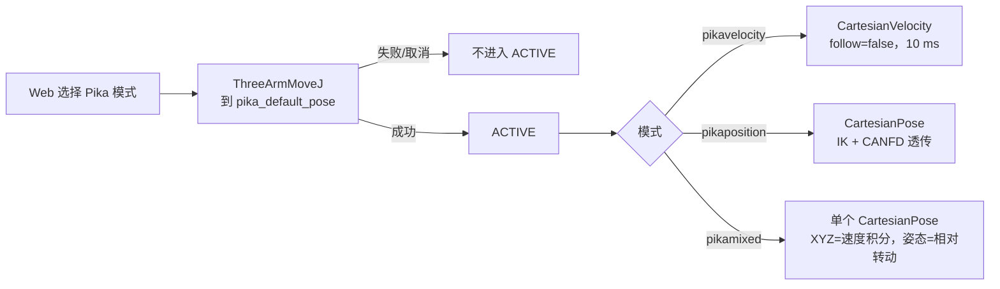
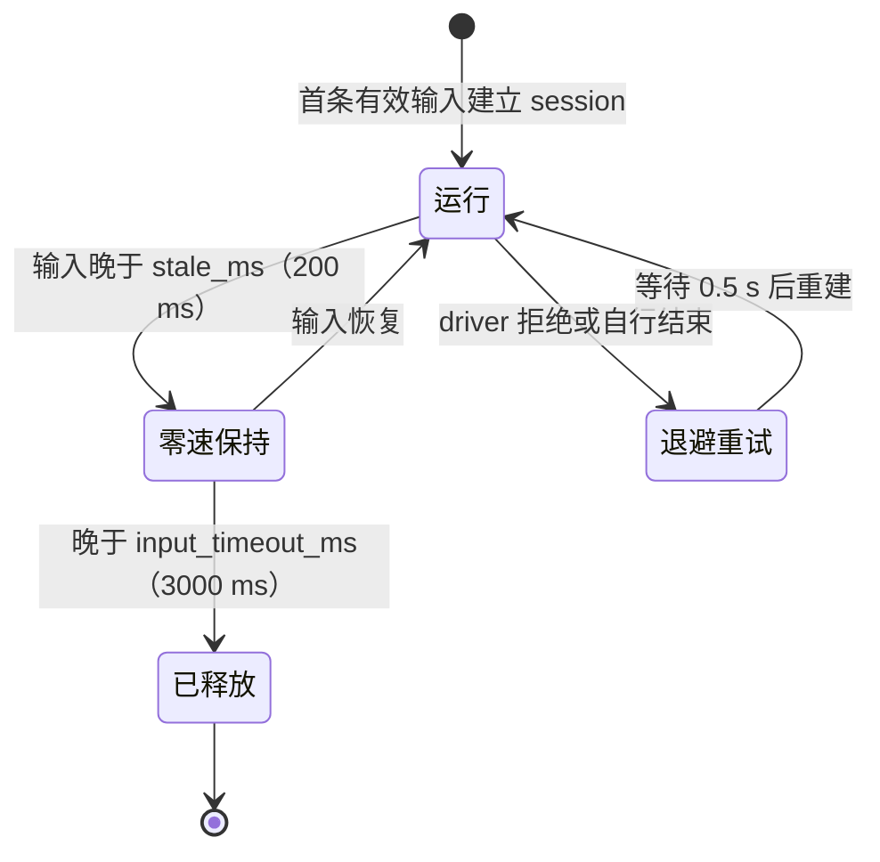

# Pika 遥操作

Pika 是由人手持的遥操作设备。它通过 ROS 2 持续发布 l/r 两只手的位姿、速度和夹爪开合度；`realman_bt` 的
`pika_control_router` 按行为树当前选中的输入模式，把这些数据转成 RealMan 驱动的 Action session 和夹爪 command。
Pika **只控制 l/r，绝不订阅或发送 m 的任何信号**。本页是 Pika 的开发契约；输入模式的选择、`control.xml`、
键盘与 Web override 见[行为树控制权与 Mock 测试](./behavior-tree-control)。

## 数据流

```text
Pika 遥操作主机（pika_teleop_ws，标称 20 Hz / 50 ms 周期）
  /pika/l|r/cartesian_pose        geometry_msgs/PoseStamped     base_link 帧
  /pika/l|r/cartesian_velocity    geometry_msgs/TwistStamped    work/pikabase 帧
  /pika/l|r/gripper_percentage    std_msgs/Float32              0 闭合 … 1 张开
        │
        ▼
pika_control_router（realman_bt，与 realman_bt_executor 同一 launch）
  只在 pikaposition / pikavelocity / pikamixed 为 ACTIVE 时转发
        │
        ├── /l|r/cartesian_velocity (Action) + /command   → 速度 session   (pikavelocity)
        ├── /l|r/cartesian_pose     (Action) + /command   → 位姿 session   (pikaposition、pikamixed)
        └── /gripper_left|right/percentage/command        → gripper_manager
```

调试 Pika 发送端与机械臂两端的方法见仓库 skill `debugging-pika-teleop-two-ends`；回放录制数据见本页[rosbag replay](#pika-rosbag-replay)。

## 三种模式



| 模式 ID | 浏览器选项 | 输入 | driver 侧 session | 适用场景 |
| --- | --- | --- | --- | --- |
| `pikaposition` | Pika / 位置控制 | `cartesian_pose`（绝对位姿） | `CartesianPose`：IK + `rm_movej_canfd` 关节透传 | 末端绝对位置跟随 |
| `pikavelocity` | Pika / 速度控制 | `cartesian_velocity`（`work/pikabase`） | `CartesianVelocity`：`follow=false`，l/r 周期 `10 ms` | 手速直接映射为末端速度，可离合 |
| `pikamixed` | Pika / Mixed 控制 | 速度（XYZ）+ 位姿（姿态） | 单个 `CartesianPose` session | 位置用速度积分（可离合），姿态跟随手的旋转量（不漂移） |

三种模式共用同一套门控：进入前由行为树先用 `ThreeArmMoveJ` 把 l/m/r 移到 `pika_default_pose`，成功后才发布
`ACTIVE`；其它模式下 router 丢弃 Pika 输入，不自动开合夹爪。

## 路由与门控

同一 launch 还启动 `pika_control_router`。它接收 executor 的 active mode，并只为 l/r 管理 Pika
Action session，同时将夹爪百分比转发到 `/gripper_left/percentage/command` 和
`/gripper_right/percentage/command`。只有 `pikaposition`、`pikavelocity` 或 `pikamixed` 处于 `ACTIVE` 时才转发；
其它模式会丢弃输入，不自动开合。夹爪 command topic 是非阻塞的连续控制路径，`dry_run=true`
（默认）时不发送机器人 Action 或夹爪 command。需要真实 Pika 运动时必须显式设置
`REALMAN_BT_DRY_RUN=false`，并完成低速、急停和工作区检查。


## 速度模式（`pikavelocity`）

`pikavelocity` 是实时速度流，而不是单点位置目标。其逐会话限值来自
[`config/ros/pika_config.yaml`](https://github.com/QingTianRobot/realman_pi/blob/main/config/ros/pika_config.yaml) 的 `pika_velocity`：线速度
`max_linear_speed_mps=0.15 m/s`、角速度 `max_angular_speed_radps=2.0 rad/s`、角加速度
`max_angular_accel_radps2=4.0 rad/s²`（从静止到 `2.0 rad/s` 约 `0.5 s`）。Pika 输入的线速度或角速度三轴
向量模长超过上限时，router 按模长等比例缩放并保留方向，而不是丢弃整条消息；缩放诊断按每臂限频。
Pika 速度 Goal 使用 `follow=false`，周期与键盘相同，为 l/r 的 `10 ms`（driver 每臂只接受一个周期）。

Pika 速度 Action 使用 `WORK` 和 `pikabase`：driver 收到该 Goal 时，如果当前已验证工作坐标不是 `pikabase`，会在同一臂
ownership 内调用坐标管理器写入、切换并读回验证已配置的 `pikabase`，成功后才启动速度 session；因此进入 Pika
速度控制不要求操作员先手动把默认 `cell` 切成 `pikabase`。目标坐标未配置、写入/切换失败或读回不匹配时保持
motion blocked，并在 Action/driver 日志中报告失败原因。限值上限由
[`config/ros/realman_motion.yaml`](https://github.com/QingTianRobot/realman_pi/blob/main/config/ros/realman_motion.yaml) 的 `hard_max_*` 字段给出，
`pika_config.yaml` 的 `pika_velocity` 不得超过它们。

## Session 保持与重发规则
输入新鲜度决定 session 的命运（速度模式的阈值；位置模式见下表）：




Pika ingress 标称 `20 Hz`，生产 DDS/调度可能出现短暂抖动。两种模式都在第一条有效输入到达时建立 session，
之后按以下规则保持：

| | 速度（`pikavelocity`） | 位置（`pikaposition`） |
| --- | --- | --- |
| 输入新鲜 | 按 `10 ms` 周期重打时间戳后重发最新速度，DDS 抖动不会触发 driver `100 ms` watchdog | 立即转发，并按周期重发最新目标位姿 |
| 输入晚于阈值 | 晚于 `stale_ms`（`200 ms`）即刷新**零速度**，session 保留 | 继续重发最后目标位姿，机械臂停在最后目标，session 保留 |
| 输入丢失 | 晚于 `input_timeout_ms`（`3000 ms`）发布零速度并取消 | 晚于 router `watchdog_ms`（`3000 ms`）取消 |
| driver 拒绝或自行结束 | 等待 `0.5 s` 再重试 | 等待 `0.5 s` 再重试 |

速度模式以前在上游中断后会**持续重发最后一个速度长达 3 s**，Pika 流一停机械臂仍按原速度运动；
`stale_ms` 把这段时间缩短到 `200 ms` 并改为零速度。位置模式以前只在 Pika 消息到达时转发，任何超过
`100 ms` 的间隔都会触发 driver 位姿 watchdog（日志 `pose command watchdog expired`）并随后重建 session。
位姿 Goal 的 `watchdog_ms` 使用 driver 配置的 `100 ms`，而不是 router 的 `3000 ms` 输入丢失窗口
（driver 会拒绝超过 `velocity_watchdog_ms` 的 Goal watchdog）。转发的位姿一律使用 router 当前 ROS 时间戳，
以保证与重发的目标严格递增。

与键盘相同，每次 Pika 激活后的 session 重开会以 `restart #N` warning 记录，结束日志会写明
`position` 或 `velocity`。这些都不放宽 driver watchdog：router 崩溃或到 driver 的发布中断时，driver 仍在
`100 ms` 内停止。

## Mixed 模式（`pikamixed`）

Mixed 模式把两路 Pika 输入组合成**一个绝对位姿 session**（`/<arm>/cartesian_pose`，与 Pika 位置模式相同的
IK + 关节透传执行路径）：

| 自由度 | 来源 | 处理 |
| --- | --- | --- |
| XYZ | `/pika/<arm>/cartesian_velocity` 的线速度（`l|r/work/pikabase`，即基座方向） | router 按模长限速、按加速度限幅，积分成绝对目标位置；角速度分量被忽略 |
| 姿态 | `/pika/<arm>/cartesian_pose` 的四元数，取**相对 session 开始时的转动量** | 目标姿态 = `q_pika · q_pika0⁻¹ · q_arm0`，以不超过 `max_angular_speed_radps` 的角速度 slerp 逼近；位置分量被忽略 |

姿态采用相对映射：session 开始后第一条有效 Pika 姿态 `q_pika0` 与锚点时的机械臂姿态 `q_arm0` 配对，之后
Pika 在基座系中转了多少（`q_pika · q_pika0⁻¹`），机械臂就在基座系中转多少，与 XYZ 线速度使用同一坐标系。
因此 Pika 的坐标系不需要与机械臂基座对齐，激活时手腕也不会先转向 Pika 的绝对姿态。早期版本直接跟随 Pika
绝对四元数：两者相差约 40° 时，激活后手腕要先转向 Pika 的绝对姿态，生产日志中表现为激活 1.5–3 s 后
IK 持续失败、机械臂停住。

姿态由 Pika 的四元数直接算出，而不是积分角速度，所以长时间使用不会漂移；XYZ 仍是速度控制，可以离合、换向，
不要求 Pika 与机械臂的绝对位置标定。**Pika 发送端在该模式下必须同时发布这两个 topic。**

生命周期：

1. 进入模式时和其它 Pika 模式一样，先由 `ThreeArmMoveJ` 到 `pika_default_pose`，再激活。
2. 第一条有效输入到达后，router 调用 `/<arm>/get_current_pose`（BASE）读取当前 TCP 位姿作为锚点，然后
   建立位姿 session；第一个目标就是锚点本身，所以 session 从静止、原地开始。锚点读取失败时退避 `0.5 s`
   重试，不会盲目起步。
3. 之后每个控制周期（`10 ms`）积分一步并发布目标。速度输入晚于 `stale_ms` 视为零（目标按加速度限幅减速并
   停住），姿态输入晚于 `stale_ms` 保持当前姿态；两路都晚于 `input_timeout_ms` 才释放 session。
4. **牵引约束**：router 以 `pose_poll_hz` 读取实测 TCP 位姿，目标位置最多领先实测 `max_position_lead_m`，
   目标姿态最多领先实测 `max_orientation_lead_rad`。IK 失败（例如姿态不可达）或奇异导致机械臂停住时，
   目标也随之停住，不会继续转向或跑远；把 Pika 转回或移回后立即恢复，不会突然跳向远处目标。超过 `1 s`
   没有有效实测时，位置和姿态目标都停止前进。

权威配置是 [`config/ros/pika_config.yaml`](https://github.com/QingTianRobot/realman_pi/blob/main/config/ros/pika_config.yaml) 的 `pika_mixed`：

| 字段 | 默认 | 说明 |
| --- | --- | --- |
| `stale_ms` | `200` | 输入视为过期的时间，须大于 Pika `50 ms` 周期 |
| `input_timeout_ms` | `3000` | 两路输入都超过此值才释放 session |
| `max_linear_speed_mps` | `0.15` | XYZ 目标速度上限，不得超过 router 的 `0.15 m/s` |
| `max_linear_accel_mps2` | `0.10` | XYZ 目标加速度上限 |
| `max_angular_speed_radps` | `0.25` | 姿态逼近角速度上限，不得超过 router 的 `0.25 rad/s` |
| `max_position_lead_m` | `0.05` | 目标可领先实测 TCP 的最大距离 |
| `max_orientation_lead_rad` | `0.15` | 目标姿态可领先实测 TCP 姿态的最大角度 |
| `pose_poll_hz` | `10` | 牵引约束的实测位姿读取频率 |

超出 router 上限的配置会在 router 启动时被拒绝。当前生产 driver 的自定义 CasADi IK 因依赖缺失未加载，
位姿 session 使用 SDK IK；锚点读取（SDK 正解）与执行（SDK 逆解）因此参考同一末端点。启用自定义 IK 后，
每个位姿 session 会先比对其 TCP 与 SDK 正解，不一致时该 session 回退到 SDK IK，同样不会因 TCP 偏移跳变。

Pika 速度 Action 使用 `WORK` 和 `pikabase`。driver 收到该 Goal 时，如果当前已验证工作坐标不是
`pikabase`，会在同一臂 ownership 内调用坐标管理器写入、切换并读回验证已配置的 `pikabase`，验证成功后才
启动速度 session；因此进入 Pika 速度控制不要求操作员先手动把默认 `cell` 切成 `pikabase`。目标坐标未配置、
写入/切换失败或读回不匹配时仍保持 motion blocked，并在 Action/driver 日志中报告失败原因。

## 进入 Pika 前的准备动作


切入任一 Pika 模式时，行为树先用 `ThreeArmMoveJ` 将 l/m/r 移动到
[`config/ros/pika_config.yaml`](https://github.com/QingTianRobot/realman_pi/blob/main/config/ros/pika_config.yaml) 中
`pika_default_pose.left|middle|right.joint_degrees` 指定的关节角（单位：度），再激活 Pika。
`control_router.launch.py` 启动时读取这三组关节角并注入行为树黑板；同一配置中的 `tcp_pose` 不参与
这次初始 MoveJ。修改默认姿态只需更新该 YAML 并重启控制树，不要再修改 `control.xml`。准备动作失败
或切换期间被取消时，不会进入 Pika `ACTIVE`。

## 发送端消息规范

Pika 发送端应以标称 `20 Hz`（`50 ms` 周期）分别发布左右臂，消息字段如下；`header.stamp` 必须使用发送节点当前 ROS
clock、非零且严格递增，不能重复使用旧消息：

```yaml
# /pika/l/cartesian_velocity
header:
  stamp: <node.get_clock().now().to_msg()>
  frame_id: l/work/pikabase
twist:
  linear:  {x: 0.10, y: 0.00, z: 0.00}   # m/s
  angular: {x: 0.00, y: 0.00, z: 0.00}   # rad/s
```

右臂只把 `frame_id` 改为 `r/work/pikabase` 并发布到 `/pika/r/cartesian_velocity`。线速度限制按
`sqrt(vx^2 + vy^2 + vz^2)` 计算；例如 `(1, 1, 0)` 的模长约为 `1.414 m/s`，会被拒绝。
输入晚于 `stale_ms`（`200 ms`）后 router 立即发零速但保留 session，晚于 `input_timeout_ms`（`3000 ms`）才取消 session；如果 router 到 driver 的刷新链路中断，
driver 的 `100 ms` watchdog 仍会独立零速并终止 session。正常停止也应先连续发送零向量，然后切换到

## Pika rosbag replay

独立的 Pika rosbag replay 项目把 bag 中的 `l/base_link`、`r/base_link` 速度记录送入同名
`/pika/l|r/cartesian_velocity` ingress。RealMan 的速度初始化没有 BASE 选项，因此 replay 在发送前
选择 identity WORK aliases `l/work/pikabase`、`r/work/pikabase`，并将 `header.frame_id` 改为相应的
`l/work/pikabase` 或 `r/work/pikabase`。Pika router 由 `pika_velocity.work_reference: work/pikabase`
配置这个引用；其零平移和单位四元数来自
[`config/ros/realman_coordinates.yaml`](https://github.com/QingTianRobot/realman_pi/blob/main/config/ros/realman_coordinates.yaml)，保持 BASE 速度向量
数值不变。键盘和默认会话仍使用 `cell`。
Replay 只发布 `/pika/l|r/cartesian_velocity` 与 `/pika/l|r/gripper_percentage`，夹爪值是
`Float32` 的归一化百分比（`0` 闭合、`1` 张开），Pika 限制为 `1.0 m/s` 和 `2.0 rad/s`。
进入执行并尝试选择坐标后，每次结束或失败会向两路速度 ingress 发送终端零向量，等待超过 `100 ms`
watchdog 后把已选或可能已选的坐标恢复为 `cell`；只读预检不会选择坐标或执行这段 cleanup。
恢复失败必须先人工确认 `/<arm>/coordinates/state`，再调用 `/<arm>/coordinates/select_work` 选择 `cell`。
夹爪不发送“零值停止”，因为 `0` 是闭合目标。

Replay 不替 control tree 选择模式。操作员先启动 `REALMAN_BT_DRY_RUN=false ./rm65 bt control`，
在 Web 页面手动选择
`Pika / 速度控制` 并等待 `ACTIVE`，再运行独立项目的 `./replay.sh run <bag>` 只读预检，最后才由
操作员显式添加 `--execute`。关闭 dry-run 后，手动进入 Pika 本身就会执行三臂准备运动，必须在选择
之前确认工作区和急停。自动验证和 `inspect` 不运行真实 `--execute`；测试中的执行分支只连接 fake。
独立项目的 `ReplayNode.spin_once()` 只在内部调度，操作员入口始终是 `replay.sh`。

Replay 部署到 `$HOME/pika_realman_replay`，使用独立 Compose 与生产 ROS domain `65`，不启动或
重启生产 driver/control tree。生命周期见 [Pika replay 边界](./behavior-tree-motion#pika-rosbag-replay-边界)，
driver 侧契约见 [ingress 与坐标桥接](./realman-action-development#pika-rosbag-replay-的-ingress-与坐标桥接)。

## 相关页面

- [行为树控制权与 Mock 测试](./behavior-tree-control)：输入模式目录、`control.xml`、模式切换与 Web override。
- [睿尔曼 Action 开发与测试](./realman-action-development)：`CartesianVelocity` / `CartesianPose` 的 driver 侧契约。
- [Changingtek 夹爪控制](./gripper-control)：夹爪 command 的 4 Hz 流式限速与健康门控。
- [故障排查](../troubleshooting)：Pika 无响应、session 反复重开、坐标不匹配。
