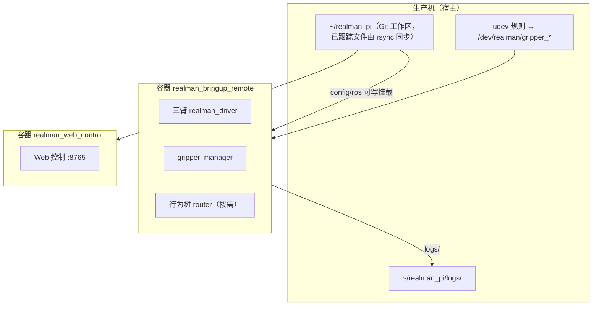

# 生产运维手册

本页是**现场记录**，面向要登录生产机查问题、更新代码或做小范围重启的开发者。它不是产品契约：命令和数值来自实际操作，带日期的条目只代表当时的状态，用之前请先核对。页面里不放主机名、内网地址、账号或密钥；这些属于你自己的 SSH 配置。

::: warning 生产机上有真实机械臂在运行
本页的"只重启一个组件"和"清理日志"都会影响运行中的系统。先确认机械臂静止、急停可达；能整套重启时优先用 `./rm65 down` / `./rm65 up`（见[CLI 与环境变量](../reference/cli-and-env)）。
:::

## 生产机布局



- **ROS 栈只在容器里**：`/opt/rm65_ws`（安装空间、源码副本、`config/ros/*.yaml`）只存在于容器内部。宿主上 `ps` 能看到这些进程（以 root 运行），但路径在宿主上不存在。读配置和日志用 `docker exec` / `docker logs`。
- **容器名**：`realman_pi-realman_bringup_remote-1`（驱动、夹爪、相机、router）和 `realman_pi-realman_web_control-1`（`:8765`）。取决于部署，还可能有策略桥、数据录制等容器；以 `docker ps` 为准。
- **配置是宿主文件**：`config/ros` 以可写方式挂进 `realman_bringup_remote`，`config` 以只读方式挂进 `realman_web_control`。所以改**宿主**上的 YAML，重启对应进程即可生效，不用重建镜像。
- **ROS domain** 是 `65`（来自 `.env`）。

## 常用查询

在容器里使用 ROS CLI 必须先 source 环境，否则看到的是一张空图：

```bash
docker exec realman_pi-realman_bringup_remote-1 bash -c '
  source /opt/ros/humble/setup.bash
  source /opt/rm65_ws/install/setup.bash
  ros2 topic echo --once /gripper_left/alarm'
docker logs --tail 100 realman_pi-realman_bringup_remote-1
docker exec realman_pi-realman_bringup_remote-1 cat /opt/rm65_ws/config/ros/gripper.yaml
```

日志目录是宿主的 `~/realman_pi/logs/` = 容器的 `/opt/rm65_ws/logs/`，每次 launch 一个 `YYYYMMDD_HHMMSS` 目录，**名字用 UTC 时间**，与宿主本地时间差一个时区。

## 更新代码（部署）

生产机**不能直接从 GitHub 拉代码**，所以从开发机把 Git 已跟踪文件同步过去。`./rm65 sync` 会校验当前在 `main` 且工作区干净，推送后再 rsync；它只同步已跟踪文件，且不带 `--delete`。

同步前先搞清楚会覆盖什么：

1. **生产机的工作区通常是"脏"的**：现场调参会直接改宿主上的 `config/ros/*.yaml`（如 `gripper.yaml`、`pika_config.yaml`、`realman_driver.yaml`）。rsync 会用开发机的版本覆盖它们。
2. 先做一次 dry-run，看哪些文件会变：

   ```bash
   git ls-files -z | rsync -azn --from0 --files-from=- --relative \
     --itemize-changes --checksum ./ <生产机>:~/realman_pi/
   ```

   如果列表里出现了你没改过的配置文件，说明生产机上有未回灌到仓库的现场修改，**先把它们合回仓库**再同步。
3. 同步只更新宿主文件。配置类改动（YAML）重启对应进程就生效；**代码类改动要重建镜像**才会进容器，因为容器里的 `src/` 是镜像构建时拷贝的副本。

只想更新 `:8765` 网页、不碰驱动时（不影响机器人运行）：

```bash
OLD=$(docker image inspect rm65-humble-rviz:local --format '{{.Id}}')
docker tag "$OLD" rm65-humble-rviz:pre-<日期>          # 回滚点
docker compose build realman_web_control               # 首次较慢（会跑 colcon 测试）
docker compose up -d --no-deps realman_web_control     # 只重建这一个容器
curl -s http://127.0.0.1:8765/api/layout | head -c 200
```

注意镜像标签 `rm65-humble-rviz:local` 是几个服务共用的：重建后，**正在运行的驱动容器仍用旧镜像**，但它下次被重启（人工、Docker 或主机重启）时会换成新镜像，把新镜像里的全部改动一并带上。回滚：把备份标签改回 `rm65-humble-rviz:local` 再重建对应容器。

::: danger 容器里的 src 可能落后于仓库
容器内的源码是上次重建镜像时的副本，可能比仓库 `HEAD` 旧（例如还没有新的 IK 接口）。**不要用 `docker cp` 整个文件覆盖进去**，只补丁你要改的那一段，并先把原文件备份到宿主（如 `~/deploy-backups/`）。
:::

## 只重启一个组件（不整套重启）

驱动容器里，`{l,m,r}_realman_driver` 是 PID 1（`ros2 launch`）的子进程，launch **不会自动拉起**它们，各进程互不影响。需要只重启一台臂的驱动或只重启夹爪 manager 时：

1. 取该进程的环境：`cat /proc/<兄弟进程 pid>/environ`（用同类进程的环境）。
2. 发 `SIGINT` 让它干净退出（约 1 秒）：`kill -INT <pid>`。
3. 用相同的可执行文件和参数重新启动，参数文件用 launch 生成的 `/tmp/launch_params_<hash>`，并指定节点名与命名空间（驱动）：

   ```text
   /opt/rm65_ws/install/realman_robot_driver/lib/realman_robot_driver/realman_driver_node \
     --ros-args -r __node:=realman_driver -r __ns:=/r \
     --params-file /opt/rm65_ws/config/ros/realman_driver.yaml \
     --params-file /tmp/launch_params_<hash>
   ```

   夹爪 manager 同理：`gripper_ros2/lib/gripper_ros2/gripper_manager --ros-args -r __node:=gripper_manager --params-file /tmp/launch_params_<hash>`，用 `setsid nohup … > /opt/rm65_ws/logs/gripper_manager.<时间>.log` 启动；启动本身不会让夹爪动作。

两个坑：

- **不要** `nohup … >> /proc/1/fd/1`：PID 1 的标准输出是 tty，`nohup` 会悄悄把输出改到 `/opt/rm65_ws/nohup.out`，`docker logs` 就看不到了。
- 手动拉起的进程**不再受 launch 管理**：下次整套重启才会恢复到 launch 管理。

`realman_web_control` 只在启动时读一次 `gripper.yaml`。改了夹爪行程后，网页上的开合百分比和 3D 夹爪模型仍用旧端点，**必须同时重启 web 容器**。

## 夹爪

**串口别名**：`/dev/realman/gripper_{right,left,mid}` 由宿主的 udev 规则按 USB 口号生成，容器里是这些设备节点的副本。规则按 USB 口号匹配，更换 USB 口后别名可能不再对应原来的夹爪，需要同步修改 udev 规则。

**告警位**：`/<name>/alarm` 的含义（来自参考 SDK 的注释，**不是**厂商手册）：

| 位 | 含义 |
| --- | --- |
| `0x01` | 过温 |
| `0x02` | 堵转 |
| `0x04` | 超速 |
| `0x08` | 初始化故障 |
| `0x10` | 限位 |
| `0x20` | 掉电 |

- `gripper_manager` **不记录告警跳变**，没有历史，只有 live topic；需要事后追溯要自己录 topic。
- 告警可能**锁存**：例如 `0x20` 在夹爪重新通电、能动之后依然是 `32`。键盘 router 和 Web 控制都会拒绝任何 `alarm != 0` 的夹爪，所以恢复供电后可能要对该夹爪执行一次 `reset`。

**行程标定**：`open_position` / `close_position` 必须贴着机械真实行程，否则"全开"只是半开。2026-09-28 的标定实测机械极限（设备单位）是：右 `8..8668`、左 `1..919`（左夹爪量级约为右的 1/10，单位待确认）、中 `0..9000`。曾经仓库里右夹爪是 `4000/12000`、左是 `400/949`，导致"全开"只有约 55%。生产机已改为右 `50/8500`、左 `20/900`（各留约 2% 余量，操作员确认开合正常）。

::: warning 仓库 main 与生产机的行程不一致
截至 2026-10-10，生产机宿主上的 `config/ros/gripper.yaml` 已是上面的标定值，而仓库 `main` 里仍是旧值。此时执行 `./rm65 sync`（或任何 rsync）会把生产机的行程**覆盖回旧值**。在把标定值合回仓库之前，不要同步 `config/ros/gripper.yaml`。
:::

## 清理日志

宿主 `~/realman_pi/logs/` 会越积越大（一次清理从约 648 MB 降到 20 MB）：

- 许多目录属于 root，宿主直接 `rm` 会失败，改用 `docker exec realman_pi-realman_bringup_remote-1 rm -rf /opt/rm65_ws/logs/<目录>`。
- 删"昨天"的目录前先查容器里哪些目录**仍被打开**（`/proc/*/fd`）：当前 launch 目录和录制目录会连续几天保持打开，不能删。
- 有意不动的：`behavior-trees/`（每次运行的 XML 与 `runtime.json` 快照，不是普通日志）、`velocity-follow/`（测试数据）、Docker 自己的 json-file 日志（无法选择性裁剪）。

## 现场常见问题

- **Pika 时而抖动、时而不动**：见[Pika 遥操作：链路与已知问题](./pika-teleop#链路与已知问题)——Wi‑Fi 丢包、会话启动时手臂被拉动、`dry-run` 默认值。
- **`Custom CasADi IK unavailable`**：每次驱动启动都会出现，镜像里没有 `pinocchio` / `casadi`，使用 SDK IK，属正常。
- **在容器里看不到任何节点**：没 source `/opt/rm65_ws/install/setup.bash`，或 `ROS_DOMAIN_ID` 不是 `65`。
